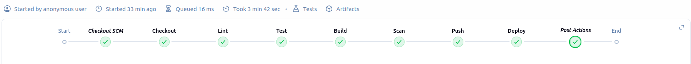
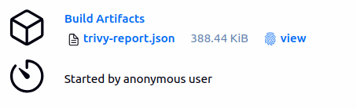
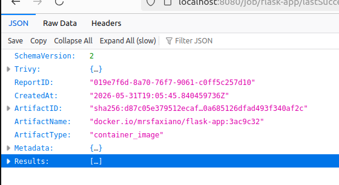
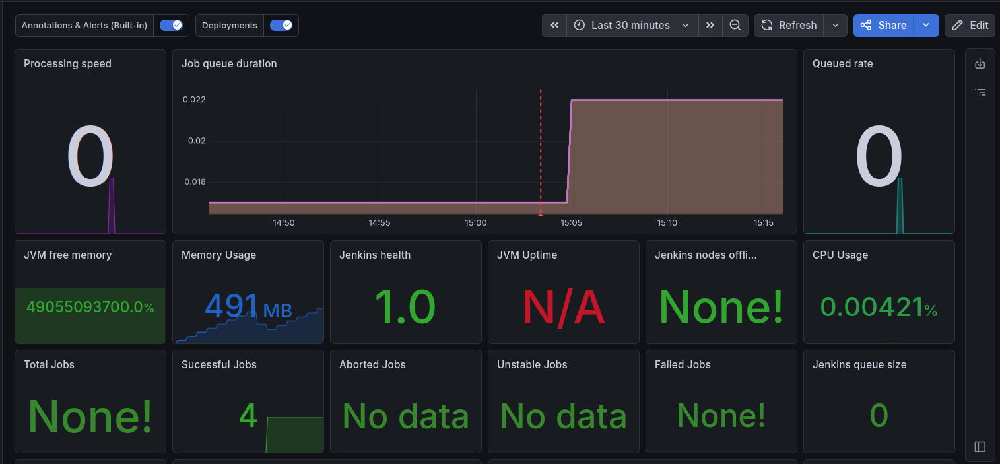
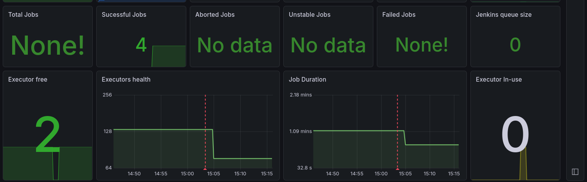

# Jenkins CI/CD Pipeline Stack

A production-inspired CI/CD infrastructure stack built with Jenkins, Docker, Prometheus, and Grafana. Designed as a portfolio project demonstrating end-to-end DevOps practices.

## Pipeline


*All 8 stages passing: Checkout SCM → Checkout → Lint → Test → Build → Scan → Push → Deploy*

## Architecture

```
Developer → GitHub → Jenkins Pipeline → Docker Hub → Staging
                          │
                    Prometheus ← /prometheus
                          │
                       Grafana (Dashboards + Alerts)
```

## Stack

| Component | Purpose |
|---|---|
| Jenkins | CI/CD orchestration |
| Docker-in-Docker | Image builds inside Jenkins |
| Prometheus | Metrics scraping from Jenkins |
| Grafana | Pipeline dashboards and deployment annotations |
| Trivy | Docker image vulnerability scanning |

## Prerequisites

- Docker Engine 24+
- Docker Compose v2
- GNU Make
- 8GB RAM minimum

## Quick Start

```bash
git clone https://github.com/MrSfaxiano/jenkins-cicd.git
cd jenkins-cicd
make up
```

Then wait ~2 minutes for Jenkins to initialize.

## Services

| Service | URL | Credentials |
|---|---|---|
| Jenkins | http://localhost:8080 | admin / admin |
| Prometheus | http://localhost:9090 | — |
| Grafana | http://localhost:3000 | admin / admin |

## Post-Start Manual Steps

After every fresh start, run these commands:

```bash
# Fix Docker socket permissions
sudo chmod 666 /var/run/docker.sock

# Install Docker CLI into Jenkins container
docker cp $(which docker) jenkins:/usr/local/bin/docker

# Install Trivy into Jenkins container
wget https://github.com/aquasecurity/trivy/releases/download/v0.70.0/trivy_0.70.0_Linux-64bit.tar.gz -O /tmp/trivy.tar.gz
tar -xzf /tmp/trivy.tar.gz -C /tmp
docker cp /tmp/trivy jenkins:/usr/local/bin/trivy
```

> These steps are required because Docker CLI and Trivy are installed at runtime
> rather than baked into the image, due to DNS restrictions in the build environment.
> In a production setup these would be baked into the Jenkins Dockerfile.

## Jenkins Pipeline

The pipeline is defined in the `flask-app` repo's `Jenkinsfile` and triggers automatically on every push via GitHub webhook.

### Quality Gates

- **Flake8** — fails on any PEP8 violation
- **pytest + coverage** — fails if coverage drops below 70%
- **Trivy** — scans built image for HIGH/CRITICAL CVEs, archives report as build artifact

## Trivy Vulnerability Report


*Trivy report archived as a build artifact on every pipeline run*


*JSON report showing scanned image, CVEs found, and artifact metadata*

## Grafana Dashboards


*Jenkins dashboard showing job queue duration, memory usage, successful builds, and deployment annotation (red dotted line)*


*Executor health, job duration trends, and queue metrics — deployment annotation visible across both panels*

## Prometheus Alerts

| Alert | Condition | Severity |
|---|---|---|
| JenkinsHighBuildFailureRate | >30% failure rate over 1h | warning |
| JenkinsDown | Jenkins unreachable | critical |

## Makefile Commands

```bash
make up              # Start the full stack
make down            # Stop all services
make logs            # Tail all logs
make logs s=jenkins  # Tail Jenkins logs only
make ps              # Show running containers
make clean           # Destroy everything including volumes
```

## Known Limitations

- Docker CLI and Trivy must be manually installed into the Jenkins container after every restart (see Post-Start Manual Steps)
- ngrok is required for GitHub webhooks if running on a home/NAT network
- Grafana admin password is not changed from default — change before any public exposure

## Related Projects

- [flask-app](https://github.com/MrSfaxiano/flask-app) — the application being built and deployed by this pipeline
